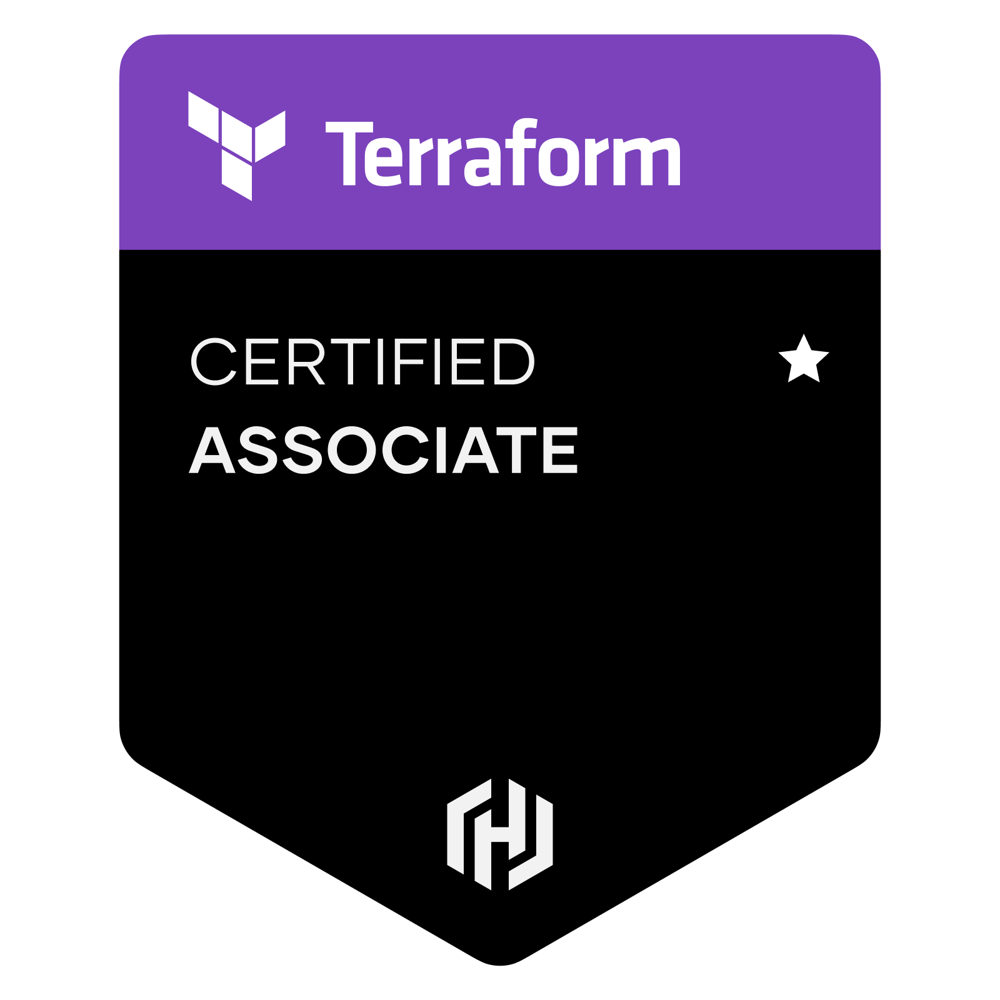
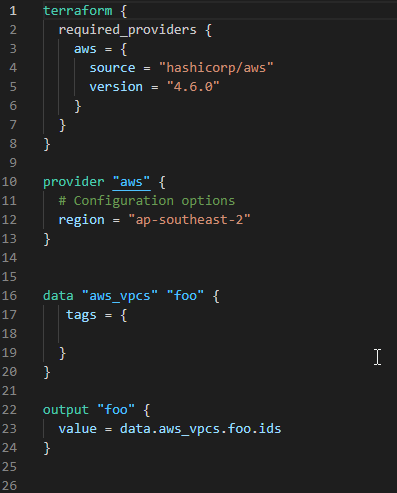

## 10 Min - Revision notes for Terraform Associate Exam.


 

This repo is a collection of study note prepard to use it for revission before the exam.


<p align="center">
 
</p>


|  Study materials  |  Links |
| ------------ | ------------ |
|    |  [LINK](https://www.youtube.com/watch?v=V4waklkBC38&ab_channel=freeCodeCamp.org) </br> A Free Course Developed by Andrew Brown from ExamPro |
|   |[LINK](https://cloudacademy.com/learning-paths/terraform-associate-certification-exam-preparation-1-2814/)  |
|   | [LINK](https://learn.acloud.guru/course/hashicorp-certified-terraform-associate-1/dashboard) |


### Click on each topic below to expand the content

<details close>
<summary>What is IAC ? Understanding Infrastructure As Code .</summary>

## IAC 

## What Is IAC? Understanding Infrastructure As Code

- Deploy your infrastucture resources with code.
- It enables DevOps, version control, better collabration
- Declarative - code in a readable format not worring about api
- speed, cost , reduced risk

below code is an example for IAC, thi is a code to get current VPCs from **AWS** environment




  
## Terraform
- Terrform is declarative 
- Codify your Software defined neteorking
- all cloud IAC solution (AWS,GCP,Azure) , cloud agnostic
- check out all providers for terraform, [LINK](https://registry.terraform.io/browse/providers)

</details>

<details close>
<summary>Terraform Work Flow, IaC with Terraform .</summary>

## Terraform Work Flow

**Write -> Plan -> Deploy**

**Write** the code, **plan** and review the code & once you are happy **Apply** to deploy the resources.


## terraform init

- it initialize the directory
- which means it will add modules and plugins.
- setup up **backend**

</details>


<details close>
<summary>Terraform plan , terraform apply & terrraform destroy.</summary>

## PLAN

`terraform plan`

- it allow the users to review the code
- helps to understand what are you deploying 
- your Auth keys are used only if needed

## APPLY
` terrform apply`

-  deploy the code , create resources in your cloud
-  updates the **statefile**, `terraform.tfstate`
-  tfstate can store in local and remote

## DESTROY

`terraform destroy`
- destroy all your resources from cloud acording to the config file, that you created using code.


</details>


<details close>
<summary>Provider Block, resource Block and data block .</summary>

## provider block

aws , google , azure

```
terraform {
  required_providers {
    aws = {
      source = "hashicorp/aws"
      version = "4.8.0"
    }
  }
}

provider "aws" {
  # Configuration options
}
```


## resource block

```
resource "aws_vpc" "example" {
  cidr_block = "10.0.0.0/16"
}
```

call it by `resource.aws_vpc.example`

## data block
```
data "aws_ami" "web" {
  provider = aws.west

  # ...
}
```
you can call it  by `data.aws_ami.web`


terrform will look for providers first while excuting the **.tf** files in the folder.


</details>


<details close>
<summary>Terraform installation and Providers .</summary>

## Install

- [Install on linux, Windows, Mac.](https://learn.hashicorp.com/tutorials/terraform/install-cli) 


### VS Code
-  Extention - HashiCorp Terraform, Terraform doc snippets

### Configuring Terraform with AWS 

**Method One**
-  Not a good practice but one way of doing it

```

terraform {
  required_providers {
    aws = {
      source = "hashicorp/aws"
      version = "4.6.0"
    }
  }
}

provider "aws" {
    region = "ap-southeast-2"
    aceess_key= ""
    secert_key = ""
}

```

**Method Two**

- Use IAM Programatic access with least privilage access
- then configure 


**Method Three**
```
$ export AWS_ACCESS_KEY_ID="anaccesskey"
$ export AWS_SECRET_ACCESS_KEY="asecretkey"
$ export AWS_DEFAULT_REGION="us-west-2"
$ terraform plan
```
**Method Four**
```
terraform {
  required_providers {
    aws = {
      source = "hashicorp/aws"
      version = "4.6.0"
    }
  }
}

provider "aws" {
    profile = "default"
  region = "ap-southeast-2"
}
```

## Terraform CLI Sub-Commands

```bash
terraform -help
```

**Main commands:**

  `init`          - Prepare your working directory for other commands.
  `validate`      - Check whether the configuration is valid / Making sure     syntax is correct.
  `plan`         - Show changes required by the current configuration / lets us know what terraform will do with the script .
  `apply`         - Create or update infrastructure/ deploy Infrastucture.
  `destroy`      - Destroy previously-created infrastructure.
</br>
**All other commands:**

  `console` - an interactive command prompt.
  `fmt`    - Reformat your configuration in the standard style.
  `output` - output values from your root module.
  `force-unlock`  Release a stuck lock on the current workspace.
  `get`          Install or upgrade remote Terraform modules.
  `graph`         Generate a Graphviz graph of the steps in an operation.
  `import`        Associate existing infrastructure with a Terraform resource.
  `login`         Obtain and save credentials for a remote host.
  `logout`        Remove locally-stored credentials for a remote host.
  `providers`    Show the providers required for this configuration.
  `refresh`       Update the state to match remote systems.
  `show`         Show the current state or a saved plan.
  `state`         Advanced state management.
  `taint`         Mark a resource instance as not fully functional.
  `test`         Experimental support for module integration testing.
  `untaint`       Remove the 'tainted' state from a resource instance.
  `version`       Show the current Terraform version.
  `workspace`     Workspace management.

</br>
Global options (use these before the subcommand, if any):
  -chdir=DIR    Switch to a different working directory before executing the
                given subcommand.
  -help         Show this help output, or the help for a specified subcommand.
  -version      An alias for the "version" subcommand.


</details>


<details close>
<summary>Terraform State .</summary>

##  Terraform state file - `terraform.tfstate` 
- track your resources state.
- identify the changes and othe details about the deployed infrastucture is shown in this file
- json format
- sensitive file 
- can be kept in remote storage place (example: - S3)


- tracked and stored in `terraform.tfstate` 
- `terraform.tfstate.backup` is a backup file
- helps to detect drift
- `terraform refresh` - helps to find drift
- store state in local and can setup to store in remote like s3
- remote state is more secure
- terrform state can be locked and locks by default by terraform locally

</details>


<details close>
<summary>Terraform variables & outputs .</summary>

 
 ## varibles
examples how variables are declared.

```
variable "availability_zone" {
  type    = string
  default = "us-west-1a"
}
```

```
variable "my-variable"{}
```

- use it separate in `variable.tfvars` file.
- you can add validation during running variables 
- can add `sensitive` to data, its a bool value - `true or false`
  

### Types

#### base types
- string
  - example
   ```
    variable "image_id" {
    type        = string
    description = "The id of the machine image (AMI) to use for the server."
    }
    ```
- number
- bool
  - example
    ```
    variable "user_information" {
      type = object({
        name    = string
        address = string
      })
      sensitive = true  
    }

    resource "some_resource" "a" {
      name    = var.user_information.name
     address = var.user_information.address
    }

    ```
  
#### complex types  

- list
  - example
  ```
  variable "az_names"{
      type = list(string)
      default=["ap-southeast-2"]
  }
  ```

- set
- map
- object 
- tuple
  

## Output

```
output "instance_ip_addr" {
  value = aws_instance.server.private_ip
}
```

- return values from the config file
-  if you declare it, you will get outputs printed acording to the code


</details>


<details close>
<summary>Terraform Provisioners.</summary>

## Provisioners

run script **locally** or on **remote resources**

There are Two type of Provisioners
- **Create-time** , run when resource creation 
- **Destroy-time** , run when resource distruction 
  

Best Practice
- if there is a inherent waty to pass the script by public cloud provider , use that.
- terraform cannot track through state files.


if the script running pn a resource fails it `taint` the resource and re-provission on next `terraform apply`.

[Official Documentation](https://www.terraform.io/language/resources/provisioners/syntax)

 - example 

```
resource "null_resource" "mk" {
  provisioner "local-exec" {
    command = "echo '0' > status.txt"
  }
  provisioner "local-exec" {
     # this runs only during when destroy   
    when    = destroy
    command = "echo '1' > status.txt"
  }
}
```


</details>


<details close>
<summary>Terraform state file .</summary>

## Terraform State
- Real world resources mapped to terraform code locally
- default Stored locally named `terraforms.tfstate`
- checks the state before modification.
- metadata tracked via .tfstate


### Terraform command
- State Management
- `terraform state list` - helps to list all resources.
- `terraform state rm` - delete a resource from state file to untrack or unmanage. (resource will not be removed when you run `terraform destroy`)
- `terraform state show` - shows details of a resource.
  


</details>


<details close>
<summary>Terraform local and remote state files .</summary>

By defaut terraform state files stored locally

## Remote State storage 

Ex: s3, google storage
- can use version control
- allows work between teams
  

## state locking

- Helps to lock the `.tfstate` file.
- supports on s3 , google cloud and Hasicrop  Cosole.
- Contains output values if defined.
  


</details>


<details close>
<summary>Terraform Modules .</summary>

## Modules

- Container which have codes for reusability.
  
### How to?
- refer from public terraform library.
- can host private registery.
- can store locally and reference.
- can provide outputs if configured to main block.

- **example**  for a terraform-aws-modules from terraform registry.

    ```
    module "ec2_instances" {
  source  = "terraform-aws-modules/ec2-instance/aws"
  version = "2.12.0"

  name           = "my-ec2-cluster"
  instance_count = 2

  ami                    = "ami-0c5204531f799e0c6"
  instance_type          = "t2.micro"
  vpc_security_group_ids = [module.vpc.default_security_group_id]
  subnet_id              = module.vpc.public_subnets[0]

  tags = {
    Terraform   = "true"
    Environment = "dev"
     }
    }
    ```


</details>


<details close>
<summary>Terraform input and output modules .</summary>

## Inputs
- Inputs that passed to Modules

## Outputs
- Output can be called in main module using `module.module_name.output_name`


</details>


<details close>
<summary>Build in functions.</summary>

## build in functions

https://www.terraform.io/language/functions

- file
- max
- log(50, 10)

are some examples

  


</details>


<details close>
<summary>Type constraints .</summary>

**Sigle type value**
number = 3
stringtype- "this is a string"
boolvalue = "true"

**Collections type**
list()
map()
set()

**Structrural**
object(type)
tuple(type)
set(type)


</details>


<details close>
<summary>Dynamic Blocks.</summary>

### Dynamic Blocks
Helps to create repatable nested configarations

 - data blocks
 - resources block
 - provider block
 - provissioner block
  

Dynamic blocks makes code cleaner but bit harder than normal so use it with caution.


</details>


<details close>
<summary>Terraform fmt, taint, import .</summary>


`terraform fmt`

- Format code for readability
- can run at any time
- doesnot change anything else
  
`terraform taint resource_address`
- marks the resources neeed to be tainted, recreate on next apply.
- Modify only statefile.

`terraform import resource_address_id`  
- import already deployed resources to terraform.

**Terraform configuration block**

```
  terraform {
  required_providers {
    aws = {
      source = "hashicorp/aws"
      version = "4.8.0"
    }
  }
}

provider "aws" {
  # Configuration options
}
```

</details>


<details close>
<summary>Terraform Work Flow, IaC with Terraform .</summary>


</details>


<details close>
<summary>Terraform Workspace .</summary>

## WorkSpaces

- always have default workspace.
- used for multipple work environments
- like dev-test-prod
- Check  `terraform workspace -help`


#### `terraform workspace new <workspace-name>`
- create new work space
#### `terraform workspace select <workspace-name>` 
-  jump into new workspace


</details>


<details close>
<summary>Debugging .</summary>

#### `export tf_LOG=TRACE`
  - Turn on verbose for logging

#### ` export TF_LOG_PATH=Terraform.log `
- to export log into file name called `terraform.log`

</details>

<details close>
<summary>terraform fmt, terrafoem taint, terraform import.</summary>

`terraform fmt` - beautify the code and make syntax consistant.
`terrafoem taint` - mark a resource to del , and it will be deleted on next terraform apply
`terraform import` - bring already build resources to terraform.


</details>

<details close>
<summary>Terraform Cloud and Enterprise .</summary>
 
 ## Sentinal 
- Policy as code 
- Has its own laungage
- Version contrl
- Testing and Automation
- ex :- enforce CIS Security standards

## Vault
- Secrets Management Software
- Pass temparory creds 

## terrform Registry

- Modules are stored in registry
- Publically accessable
- Anyone can contribute to Registry

## Cloud Workspaces
- workspaces hold in cloud rather than in local
- records activity 
- Can trigger via github actions
----
## OSS and Terraform Clud workspace
### OSS
- Create statefile locally
- Variables are stored in .tfvars file
- creds are stord locally 

### Cloud 
- Version control
- communicated via API/CLi
- State files stored in Cloud
- variables  are stored in cloud work space
- creds are stord in cloud
----

## Benifits of Terraform Cloud
-  remote execution
- workspace on org model
- version control
- manage remotely 
- Private registry avilable to host privately
- cost estimation
- policy as code with sentinal


</details>

----

#### More Usefull links

- Terraform Best Practices - [Link](https://www.terraform-best-practices.com/) 
- 250 Practice Questions For Terraform Associate Certification - [Link](https://medium.com/bb-tutorials-and-thoughts/250-practice-questions-for-terraform-associate-certification-7a3ccebe6a1a)